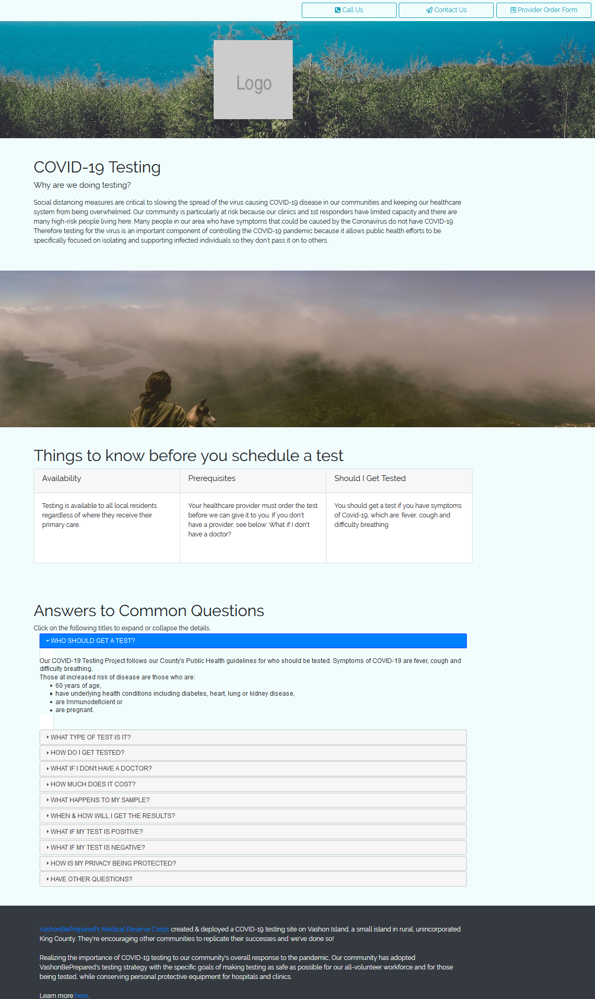

# COVID-Testing
This repository provides a free, readily modifed and deployable standards based web page for the
COVID Rural Testing &amp; Tracing Toolkit (RT3).

## About
[VashonBePrepared](https://VashonBePrepared.org) is the FEMA recognized Citizen Corps Council for rural 
Vashon Island in the Salish Sea. It is a coalition of many volunteer 
organizations - who do the real work!

Vashon's [Medical Reeserve Corps (MRC)](https://VashonBePrepared.org/MRC) is a model project that is fighting the 
COVID Pandemic on numerous fronts. 

## RT3 - Rural Testing & Tracing Toolkit
One of these is the 
[COVID Rural Testing &amp; Tracing Toolkit (RT3)](https://VashonBePrepared.org/Testing), 
that provides rural communities a proven 
toolkit for conducting their own COVID testing for local residents outside a 
formal hospital setting.

Vashon's MRC is making freely available their pioneering simple, no frills COVID-19 testing set-up that 
follows CDC guidence and can still be run by volunteers with proper training.

We are making this available to other communities around the world as a model. Learn 
more at www.VashonBePrepared.org/Testing

Within this larger context above, this particular GitHub repository, at www.github.com/EOCOnline/Covid-Testing,
provides a standards based, easily replicated web page that can be integrated into your 
existing website, and easily branded to assure your visitors.

## Rough Initial Appearance
The following is an early version of the webpage. It can be easily modified by anyone with some basic HTML skills.

## Technologies
The web pages use only the following technology, so can be implemented on nearly any HTML based platform:
* HTML5 & CSS3
* Bootstrap 4 (includes jQuery)
* jQueryUI
* FontAwesome
* Google Fonts can also be used

A sample webpage is available for your use in three formats:
* Bare HTML, with no external dependencies
* Simple styling, using Bootstrap4, jQuery, jQueryUI, and Google Fonts open source libraries
* Fancier styling, with images and Fontawesome that can serve as a standalong website, perhaps as a subdomain to your own site.

## Physician's Order Form
You can use Google Forms to easily create a Physician's Order Form. You can just create a 
link to the from from your RT3 Informatino Page, or you can embed it into your web page.

**Creating your Form**
You shoudl be able to enter this is a web browser to bring up our sample form:
[https://forms.gle/eDDjLx6hwM7Ur8WW6](https://forms.gle/eDDjLx6hwM7Ur8WW6)
Then you shoudl be able to make a copy of this form - from your own (personal) Google account 
for free and alter it as desired, including adding a heading or logo.

**Linking**

**Embedding**
To embed the form Google will provide something like the following to insert into your web page. 
The form will appear inside your web page.
'<iframe src=
"https://docs.google.com/forms/d/e/1FAIpQLSdevR_rdcH03g4KiINiHT7_vdPPGUEDaUPrUdZHUlykICFTUQ/viewform?embedded=true" 
width="640" height="855" frameborder="0" marginheight="0" marginwidth="0">Loading…</iframe>'

## Roadmap
The goal is to create three independent versions:
1. CovidTesting.htm & css/CovidTesting.css provide a single web page with some rudimentary styles including pictures so 
it could stand alone as a website, or sub-domain.
2. CovidTestingPlain.htm & css/CovidTestingPlain.css provides a single web page with minimal styling 
and one image, so that it can be included into an existing website as a new page.
3. CovidTestingBare.htm & css/CovidTestingBare.css provides a single web page with no styling 
and no graphics, so that it can be included into an existing website as a new page.

**Other goals:**
- [x] Create a basic page using only jQuery & Bootstrap
- [ ] Create the other two pages
- [ ] Distribute a basic Google Form for providers to request a patient get tested

Please list you issues or additional goals in the 2nd tab above labelled "Issues".

This is distributed with the very lenient MIT license without even a copyright. Feel free to edit this as you wiish. We ask that you include a link to the [RT3 Home Page](https://www.VashonBePrepared.org/Testing) so we can keep others informed of updates and changes.  
acknowledge where it came from and you can make changes as you see fit.
